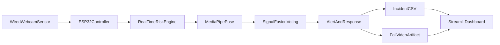

# Guardian-Pie: Real-Time Fall Risk Intelligence

Guardian-Pie is an undergraduate-built, ESP32-assisted safety system for elder care.  
It uses a wired webcam feed, real-time pose estimation, and multi-signal risk logic to detect falls, estimate severity, and trigger rapid alerts with incident evidence.

## Why This Project Matters

Falls are one of the most common and dangerous risks for elderly individuals living independently.  
In many homes and care settings, response is delayed because incidents are noticed late or not noticed at all.

Guardian-Pie is built to reduce that delay by combining:
- continuous visual monitoring (without constant human supervision),
- fast on-device risk reasoning,
- automatic incident logging and alert artifacts for caregivers.

## Ambition

Build a practical, affordable, and deployable safety intelligence layer for assisted living environments, where:
- detection is real time, not retrospective,
- alerts are evidence-backed, not guesswork,
- system outputs are understandable by caregivers and technical teams.

## The End-Consumer Problems We Solve

- **Delayed intervention:** caregivers often learn about incidents too late.
- **Lack of context:** a simple alarm does not explain severity or consciousness risk.
- **Monitoring fatigue:** humans cannot watch every camera feed continuously.
- **Poor incident traceability:** many setups lack structured records for analysis.

## What We Built

- ESP32/serial-integrated runtime pipeline with a wired camera feed.
- Real-time pose tracking with MediaPipe.
- Multi-signal fall decision engine (4 independent signals with voting).
- Tripwire breach warning logic.
- Post-fall motion check for conscious/unconscious indication.
- Event logging to CSV for black-box style traceability.
- Auto video capture of fall events for audit and review.
- Streamlit command dashboard for monitoring, analytics, and trend insights.

## System Architecture



## How It Works (High-Level)

1. ESP32 motion events activate monitoring logic.
2. Camera frames are processed in real time.
3. Pose landmarks are extracted and evaluated across four fall signals:
   - nose-to-floor proximity,
   - body aspect ratio (horizontal posture),
   - torso angle from vertical,
   - downward nose velocity.
4. Fall is confirmed with temporal stability (`FALL_FRAMES_TO_CONFIRM`) and cooldown protection.
5. System triggers buzzer/voice/notification path, records video clip, and logs incident metadata.
6. Dashboard visualizes trends, confidence, severity, and risk windows.

## Results and Outputs (Current Repository Evidence)

This repository already includes concrete runtime outputs:

- **Incident log:** `incident_log.csv`  
  Contains timestamped `FALL_EVENT`, `TRIPWIRE`, and `VITAL_CHECK` records, including angle and confidence (for example: `Angle:62 Conf:83%`).

- **Demo capture:** `fall_alert.mp4`  
  Recorded alert clip artifact for qualitative validation and presentation.

- **Dashboard analytics:** `dashboard.py`  
  Provides operational metrics such as total falls, average confidence, unconscious events, and next-24h risk estimate.


## Tech Stack

- **Embedded/Interface:** ESP32 (serial-trigger integration)
- **Computer Vision:** OpenCV, MediaPipe Pose
- **Data & Analytics:** Pandas, NumPy, Plotly
- **Dashboard/UI:** Streamlit
- **Alerting/Automation:** Telegram API, pyttsx3 voice alerts

## Quick Start

### 1) Install dependencies
```bash
pip install -r requirements.txt
```

### 2) Run real-time detection engine
```bash
python main.py
```

### 3) Run dashboard
```bash
python -m streamlit run dashboard.py
```

## Highlights

- End-to-end ownership: sensing, inference, alerting, logging, and dashboarding.
- Real-time systems thinking: latency-aware decision flow with fallback behavior.
- Product mindset: interpretable outputs for non-technical stakeholders.
- Applied AI maturity: confidence-aware detection, event evidence, and monitoring loop.

## Roadmap

- Improve robustness under occlusion/low light and crowded scenes.
- Reduce false positives with calibration + user-specific profiles.
- Add cloud sync and notification escalations (multi-channel).
- Package deployment workflow for assisted-living pilots.

## Project Identity

Guardian-Pie is not just a prototype; it is a practical step toward safer independent living through affordable embedded AI.
